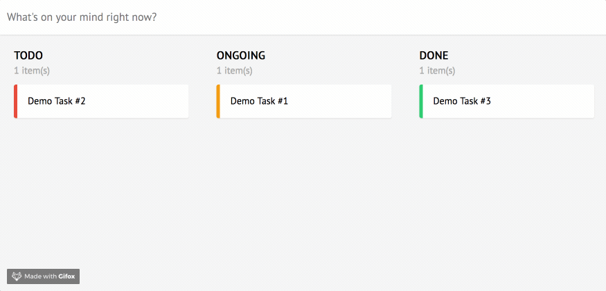
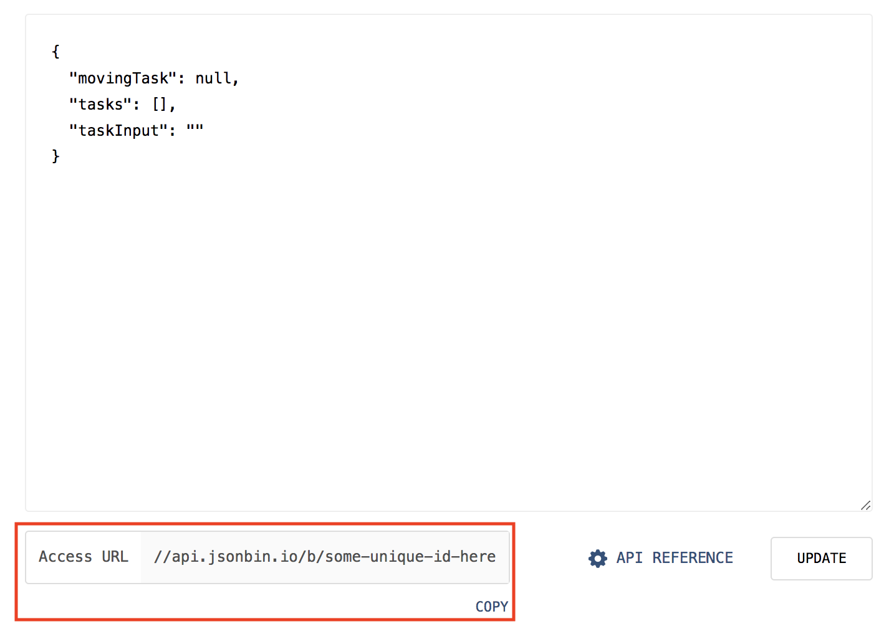
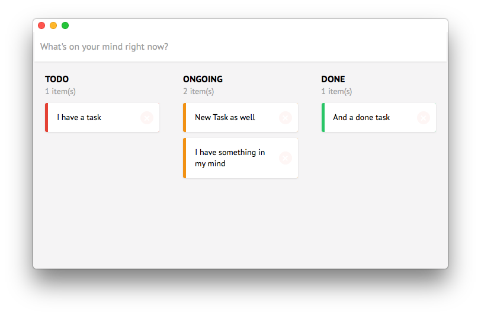
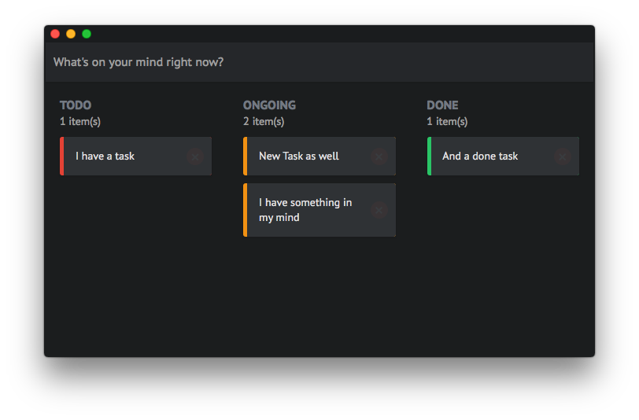

# Kanelm - Kanban Board in Elm



## Run it locally

Assume you already have Node and Elm installed, you can use either NPM or Yarn.

1. Clone this project
2. Install dependencies:
  ```
  yarn
  elm-package install
  ```
  > :bulb: Note: Use `yarn` since the `yarn.lock` dependency file is up to date.
3. Create config file from example config:

```
cp src/example.config.js src/config.js
```

Create an account on https://jsonbin.io/ to obtain the Secret key, create a new JSON file on this site. Put the URL into your `config.js`. You can find your bin's URL here:



Be sure to append a `https:` suffix to the API URL in the `config.js`, otherwise the built version in [kanban-app](https://github.com/huytd/kanban-app) won't work.

Your config should look something like this:

```javascript
module.exports = {
    SECRET: 'you-api-secret-here',
    URL: 'https://api.jsonbin.io/b/{id-of-jsonbin-bin}'
};
```

The initial data for your JSON file should be:

```json
{"taskInput": "", "tasks": [], "movingTask": null}
```

4. Start the dev server:
  ```
  yarn start
  ```

## Deploy it on your server

To deploy it on your server, just run `npm build` and copy the two files in `dist` folder. It run as a static HTML page, so you can even put it on Github Pages.

## Themes

To use dark theme, add `dark` class into `container**:

**src/Main.elm**

```elm
view : Model -> Html Msg
view model =
  ...
      div [ class "container dark" ] [
  ...
```

Light theme



Dark theme



# Database Setup

Install postgres

Debian:
```bash
su - #login to root
su - postgres #login to postgres
createuser --interactive
```

Once you've created a user login to that user:
```bash
su - username
createdb dbname
```

pg driver requires a password so we'll set it up with our database:
```sql
psql dbname
ALTER USER username WITH PASSWORD 'new_password';
```

Now we will create our db.json file:
```js
{
 "driver":"postgres",
 "connection-str":"user=username password=password dbname=dbname"
}
```